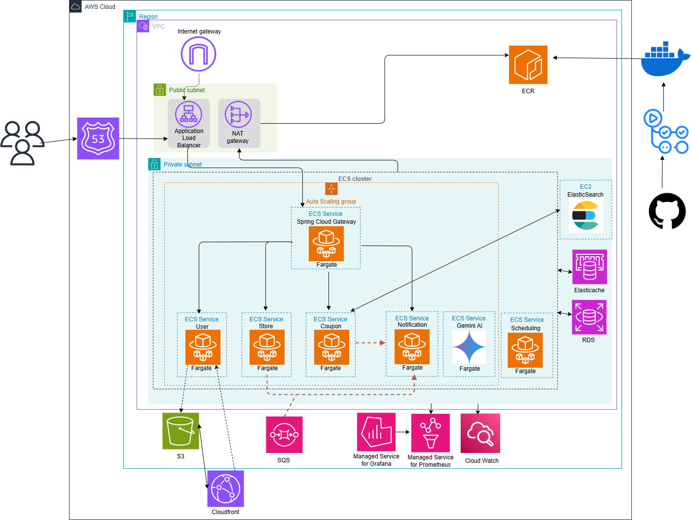

# 🎟️ 구독 기반 실시간 쿠폰 뷰어 서비스
# 1. 팀원 소개
<table>
  <tr>
    <td width="200" align="center" valign="top">
       
      <b>박세진</b> 
      🪪 팀장  
      📌 가게 및 쿠폰 구독 기능 구현 
      📌 구독 알림 메일 전송 기능 구현 
      📌 CI/CD 구현 
      📌 Store Service 분리
    </td>
    <td width="200" align="center" valign="top">
       
      <b>오명제</b> 
      🧱 부팀장  
      📌 가게 CRUD 구현 
      📌 ElasticSearch 
      📌 AI 추천 기능 구현
    </td>
    <td width="200" align="center" valign="top">
       
      <b>김나연</b> 
      💡 팀원  
      📌 사용자 CRUD 및 인증 / 인가 구현 
      📌 쿠폰 만료 및 발급 알림 구현 
      📌 Gateway 및 User Service 분리 
      📌 Terraform 기반 인프라 구성
    </td>
    <td width="200" align="center" valign="top">
       
      <b>이보연</b> 
      💡 팀원  
      📌 쿠폰 발급 및 발급 내역 관리 기능 구현 
      📌 쿠폰 발급 시 동시성 제어 구현 
      📌 쿠폰 사용량 집계 배치 작업 구현 
      📌 Notification Service 분리
    </td>
        <td width="200" align="center" valign="top">
       
      <b>권호준</b> 
      💡 팀원  
      📌 쿠폰 CRUD 구현 
      📌 모니터링 툴 세팅 
      📌 캐싱, 인덱싱을 적용한 조회 성능 최적화 
      📌 Coupon Service 분리
    </td>
  </tr>
</table>

# 2. 🔁 서비스 플로우

# 3. 🔥 주요 기능
👤 **사업자용 기능**
- 가게 등록 / 수정 / 삭제
- 쿠폰 발행
- 쿠폰 사용랑 통계 조회
---
🛍️ **사용자용 기능**

- 매장별 쿠폰 탐색 및 AI 쿠폰 추천
- 쿠폰 발급 및 발급 내역 확인
- 관심 매장 쿠폰 발행 및 쿠폰 만료 알림 기능
---
🧭 **공통 기능**

- 로그인 및 권한 분리 (사업자 / 일반 사용자)
- 회원 프로필 관리
- 쿠폰 상태 자동 변경 (만료 처리 등)

# 4. 🖥️ System Architecture

## 🧩 아키텍처 개요

    **쿠폰모아**는 **MSA (Microservice Architecture)** 기반으로 구성된 웹 서비스입니다.
    기능별로 독립된 서비스를 구성하여 유지보수성과 확장성을 높였으며, Spring Cloud Gateway를 통해 클라이언트 요청을 각 서비스로 라우팅합니다.

---
## 🗺️ AWS 인프라 아키텍처

<strong>📦 아키텍처 구성 요소</strong>

<table>
  <tr>
    <td><b>네트워크</b></td>
    <td>VPC, Public / Private Subnet, Internet Gateway, NAT Gateway</td>
  </tr>
  <tr>
    <td><b>트래픽 라우팅</b></td>
    <td>Route 53, Application Load Balancer (ALB)</td>
  </tr>
  <tr>
    <td><b>컨테이너 오케스트레이션</b></td>
    <td>ECS + Fargate 기반 마이크로서비스 서비스 디스커버리를 위한 Cloud Map</td>
  </tr>
  <tr>
    <td><b>데이터 계층</b></td>
    <td>RDS(MySQL), ElastiCache(Redis), EC2 기반 Elasticsearch</td>
  </tr>
  <tr>
    <td><b>정적 리소스 처리</b></td>
    <td>S3 + CloudFront (이미지 등 정적 자원 처리)</td>
  </tr>
  <tr>
    <td><b>비동기 통신</b></td>
    <td>Amazon SQS (알림 처리용 메시지 큐)</td>
  </tr>
  <tr>
    <td><b>모니터링 / 알림</b></td>
    <td>Prometheus, Grafana, CloudWatch, EventBridge, Lambda</td>
  </tr>
  <tr>
    <td><b>CI / CD 및 이미지 저장소</b></td>
    <td>GitHub Actions → ECR</td>
  </tr>
</table>

<strong>🛠️ Terraform 기반 인프라 관리</strong>

### ▪️ Infrastructure as Code (IaC)

- 모든 리소스를 Terraform으로 선언적 관리

### ▪️ 구성 파일 구조

- 기능별 분리:  
  <code>vpc.tf</code>, <code>ecs.tf</code>, <code>alb.tf</code>, <code>sg.tf</code>, <code>rds.tf</code>, <code>sqs.tf</code>, <code>ecr.tf</code> 등

---

## 🧱 애플리케이션 아키텍처
<table>
  <tr>
    <td><b>서비스명</b></td>
    <td><b>역할</b></td>
  </tr>
  <tr>
    <td><b>Spring Cloud Gateway</b></td>
    <td>클라이언트 요청을 내부 서비스로 라우팅, 인증 및 인가</td>
  </tr>
  <tr>
    <td><b>User Service</b></td>
    <td>회원가입, 로그인, 사용자 정보 관리</td>
  </tr>
  <tr>
    <td><b>Store Service</b></td>
    <td>매장 생성, 수정, 조회</td>
  </tr>
  <tr>
    <td><b>Coupon Service</b></td>
    <td>쿠폰 발행, 발급, 조회, 사용</td>
  </tr>
  <tr>
    <td><b>Notification Service</b></td>
    <td>쿠폰 생성, 발급, 만료 알림 전송</td>
  </tr>
  <tr>
    <td><b>Batch Service</b></td>
    <td>쿠폰 사용량 집계 등 배치 작업</td>
  </tr>
  <tr>
    <td><b>AI Service</b></td>
    <td>AI 기반 추천 쿠폰 ID 생성</td>
  </tr>
</table>

<strong>서비스 간 통신 방식</strong>

서비스 간 통신은 **gRPC** 또는 **비동기 메시지 큐(AWS SQS)**를 통해 이루어집니다.

- **동기 처리**가 필요한 경우 성능이 뛰어난 **gRPC** 방식으로 서비스를 호출하고,
- **비동기 처리**가 필요한 이벤트성 작업은 **SQS Queue**를 통해 안정적으로 전달됩니다.

**📶 예시**
<table>
  <tr>
    <td><b>통신 주체</b></td>
    <td><b>방식</b></td>
    <td><b>설명</b></td>
  </tr>
  <tr>
    <td>Coupon Service → Store Service</td>
    <td>gRPC</td>
    <td>쿠폰 생성 시 매장 유효성 확인</td>
  </tr>
  <tr>
    <td>Coupon Service → Notification Service</td>
    <td>SQS</td>
    <td>쿠폰 발급 완료 후 알림 전송</td>
  </tr>
</table>

---

## 🔄 GitHub Actions를 활용한 CI/CD Pipeline

### ✅ CI  
- <b>Trigger:</b> dev 브랜치에 코드가 push되거나 PR 발생 시 실행  
- <b>Test:</b> 테스트 코드 수행  

### ✈️ CD  
- <b>Trigger:</b> dev 브랜치에 코드가 push되고, CI가 성공적으로 완료되었을 때 실행  

- <b>Build & Deploy:</b>  
  • AWS ECR에 Docker 이미지 빌드 및 푸시  
  • AWS ECS에 새로운 이미지로 서비스 업데이트  

- <b>Security:</b> GitHub Secrets에 AWS 인증 정보 등 비밀 값 저장  

# 5. 💡 ERD설계

  
<strong>v1(초반 설계)</strong>

  

  
<strong>v2(MSA 설계 전)</strong>

  

  
<strong>v3 (MSA 설계 후)</strong>
 
  
  ### 📌 user service  
  

  ### 📍 store service  
  

  ### 🎟️ coupon service  
  

  ### ✉️ notification service  
  

---

# 6 🧐 기술적 의사 결정

  
🏃 [비동기 처리] 쿠폰 만료 알림 비동기 처리

  
🏃 [동시성 제어] 쿠폰 발급 시 동시성 제어 전략 비교

  
🏃 [비동기 처리] 구독 시 신규 쿠폰 알림 비동기 처리

  
🏃 [AI 활용] AI를 활용한 개인화 쿠폰 추천 시스템

  
🏃 [Architecture] MSA 구조화 및 배포

  
🏃 [API 문서화] Spring REST Docs 도입

  
🏃 [인프라 전략] IaC 기반 클라우드 인프라 구성 배경

---

# 7. ⚡ 성능 비교

  
🏃 [WebFlux] SSE 알림에서 MVC와 WebFlux 방식 성능 비교

  
🏃 [CloudFront] 이미지 조회 시 S3, CloudFront 성능 비교

  
🏃 [Spring Batch] 쿠폰 사용량 집계 작업의 성능 개선기

  
🏃 [gRPC] 서버간 gRPC vs REST 통신 방식 성능 비교 

  
🏃 [ElasticSearch] 쿠폰 검색 기능 DB, ElasticSearch 성능 비교

---

# 8. 🚨 트러블슈팅

  
🎯 Spring 애플리케이션에서 Fargate Task Role 인식 실패 문제 해결

  
🎯 ECS 배포 시 오토스케일링 문제

---

# 9. 🛠 기술 스택

<table width="100%">
  <tr>
    <td valign="top">
      <b>🧠 Language</b> 
        
        Java  
      

      <b>👨‍💻 Backend</b> 
        
        Spring 
        
        Spring Boot 
        
        Spring Data JPA 
        
        Spring WebFlux 
        
        QueryDSL  
      

      <b>💾 Database</b> 
        
        MySQL 
        
        Redis 
        
        Elasticsearch 
        
        AWS ElastiCache 
        
        AWS RDS  
  

      <b>📧 Email</b> 
        
        JavaMailSender  
      

      <b>📈 Monitoring</b> 
        
        Spring Actuator 
        
        Prometheus 
        
        Grafana 
        
        AWS CloudWatch  
      

      <b>👥 Collaboration</b> 
        
        GitHub 
        
        Slack 
        
        Notion 
        
        ERD Cloud  
      

      <b>🏁 Test</b> 
        
        Spring REST Docs 
        
        Postman 
        
        Swagger 
        
        JMeter
        
        K6  
      

    </td>
    <td valign="top">
      <b>🌐 IDE</b> 
        
        IntelliJ IDEA  
      

      <b>🔐 Security</b> 
        
        JWT 
        
        Spring Security  
      

      <b>⏰ Batch</b> 
        
        Spring Batch  
      

      <b>✉️ Inter-Service Communication</b> 
        
        AWS SQS 
        
        gRPC  
      

      <b>🤖 AI</b> 
        
        Google Gemini API 
        
        Spring AI  
      

      <b>✈️ CI/CD</b> 
        
        GitHub Actions 
        
        Docker  
      

      <b>☁️ Infra</b> 
        
        Terraform 
        
        AWS ECS, ECR, Fargate, EC2 
        
        AWS Route53, S3, ALB 
        
        Internet Gateway, NAT Gateway 
        
        AWS IAM, Lambda, EventBridge 
        
        Cloud Map, Certificate Manager  
      

    </td>
  </tr>
</table>
